  

---

## About

Software Engineer with experience designing and developing full-stack applications, backend services, cloud-enabled solutions, data-driven systems, and database-driven applications across professional, freelance, and academic environments.

Skilled in Java, C#, Python, PHP, JavaScript, TypeScript, React, Angular, .NET, Django, Flask, SQL, Docker, AWS, Data Science, and Data Analytics.

Focused on building scalable, maintainable, and secure solutions while applying sound architectural principles, data-driven decision making, performance optimization techniques, and clean code practices to deliver reliable business outcomes.

---

## Connect

  
  
  

---

## Technologies

### Software Development

  

### Data Science & Analytics

  

  
  
  

### Cloud, DevOps & Tools

  

  
  

### Additional Technologies & Tools

Java EE (JSP, Servlets, JPA, EJB) • AWS S3 • GitHub Actions • CI/CD • REST APIs • Containerization • Authentication & Authorization • Machine Learning • Data Visualization • Statistical Analysis
